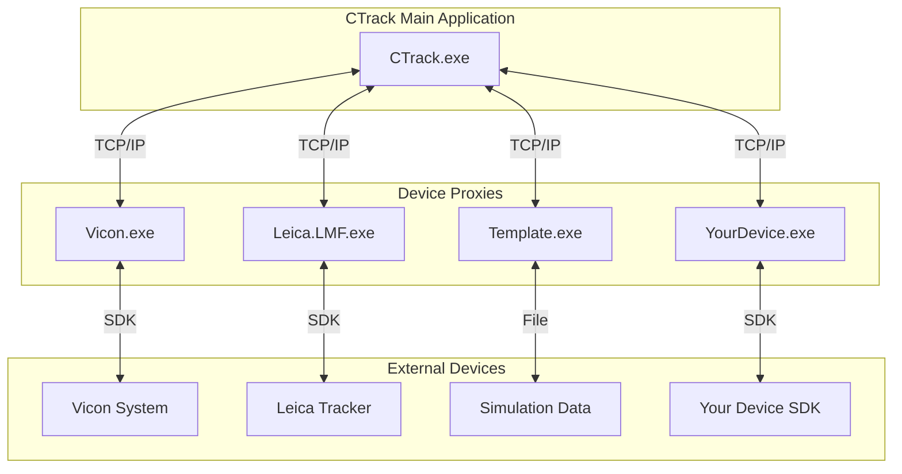
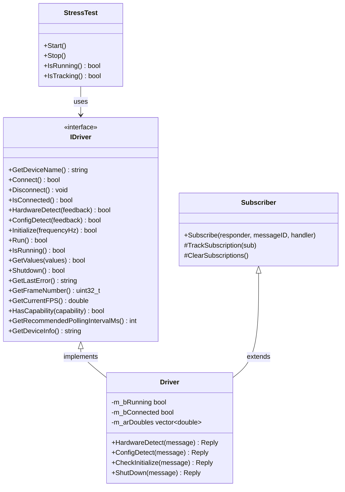
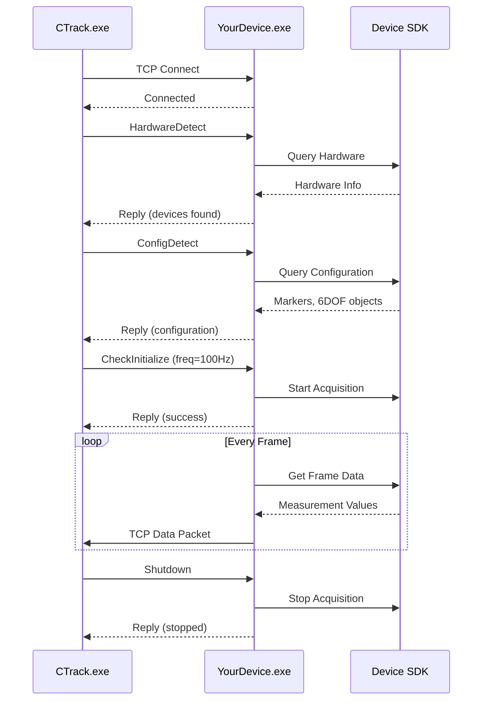
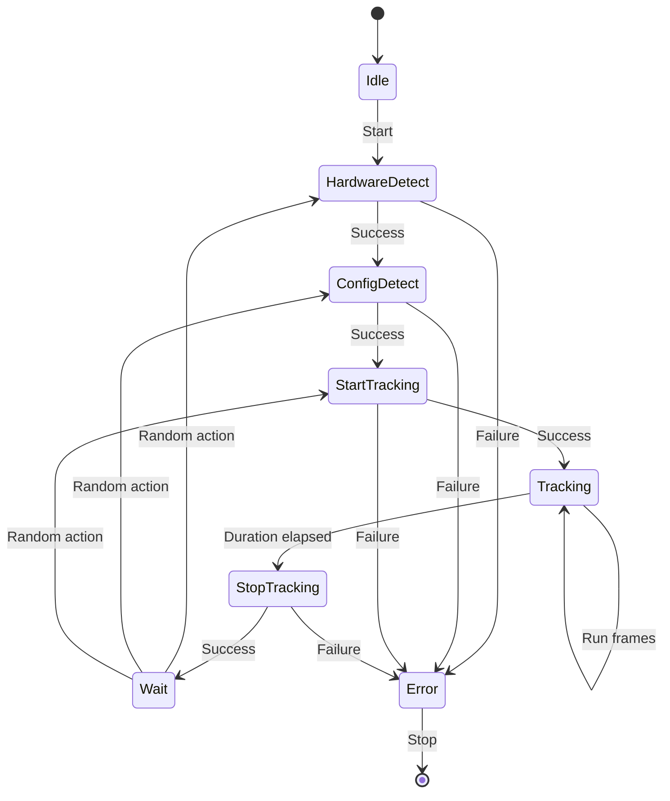

# Creating a New Device Proxy

This guide explains how to create a new device proxy for CTrack based on the Template proxy. Device proxies are standalone executables that communicate with external measurement devices and relay data to the main CTrack application via TCP.

## Architecture Overview



## Project Directory Structure

```
Proxies/
├── Libraries/                    # Shared code across all proxies
│   ├── Driver/
│   │   └── IDriver.h            # Abstract driver interface
│   ├── TCP/
│   │   ├── Message.h/.cpp       # JSON message wrapper
│   │   ├── MessageResponder.h/.cpp
│   │   ├── Subscriber.h         # Subscription pattern helper
│   │   ├── Subscription.h/.cpp
│   │   ├── TCPCommunication.h/.cpp
│   │   └── TCPTelegram.h/.cpp
│   ├── Testing/
│   │   ├── ProfilingControl.h   # Tracy profiling wrapper
│   │   ├── StressTest.h/.cpp    # Generic stress testing
│   │   └── (TracyClient.cpp)    # Tracy client (from submodule)
│   ├── Utility/
│   │   ├── Print.h/.cpp         # Console output utilities
│   │   ├── Logging.h/.cpp       # File logging
│   │   ├── CommandLineParameters.h/.cpp
│   │   └── ...
│   └── XML/
│       ├── ProxyKeywords.h      # Message attribute constants
│       └── ...
├── Template/                     # Template proxy (copy this!)
│   ├── Driver.h                 # Your driver class header
│   ├── Driver.cpp               # Your driver implementation
│   ├── main.cpp                 # Entry point and message loop
│   ├── Template.vcxproj         # Visual Studio project
│   └── Template.vcxproj.filters
├── Vicon/                       # Example: Vicon implementation
├── Leica.LMF/                   # Example: Leica implementation
└── YourDevice/                  # Your new proxy goes here
```

## Class Architecture



## Message Flow



## Step-by-Step Guide

### Step 1: Copy the Template

```bash
cd Proxies
cp -r Template YourCompany.YourDevice
```

Rename files:
- `Template.vcxproj` → `YourDevice.vcxproj`
- `Template.vcxproj.filters` → `YourDevice.vcxproj.filters`
- `Template.sln` → `YourDevice.sln`

Update the project GUID in the `.vcxproj` file.

### Step 2: Implement the Driver Class

Your `Driver` class must:
1. **Inherit from `CTrack::IDriver`** - provides the abstract interface for stress testing and profiling
2. **Inherit from `CTrack::Subscriber`** - enables message subscription pattern

```cpp
// Driver.h
#pragma once

#include "../Libraries/Driver/IDriver.h"
#include "../Libraries/TCP/Subscriber.h"
#include <YourDeviceSDK.h>  // Your vendor SDK

class Driver : public CTrack::IDriver, public CTrack::Subscriber
{
public:
    //---------------------------------------------------------------
    // IDriver Interface (REQUIRED)
    //---------------------------------------------------------------
    std::string GetDeviceName() const override { return "YourDevice"; }

    bool Connect() override;
    void Disconnect() override;
    bool IsConnected() const override { return m_bConnected; }

    bool HardwareDetect(std::string& feedback) override;
    bool ConfigDetect(std::string& feedback) override;

    bool Initialize(double frequencyHz) override;
    bool Run() override;
    bool IsRunning() const override { return m_bRunning; }
    bool GetValues(std::vector<double>& values) override;
    bool Shutdown() override;

    std::string GetLastError() const override { return m_LastError; }
    uint32_t GetFrameNumber() const override { return m_FrameNumber; }
    double GetCurrentFPS() const override { return m_CurrentFPS; }

    //---------------------------------------------------------------
    // Message Handlers (for TCP communication)
    //---------------------------------------------------------------
    CTrack::Reply HardwareDetect(const CTrack::Message& message);
    CTrack::Reply ConfigDetect(const CTrack::Message& message);
    CTrack::Reply CheckInitialize(const CTrack::Message& message);
    CTrack::Reply ShutDown(const CTrack::Message& message);

private:
    bool        m_bConnected = false;
    bool        m_bRunning = false;
    std::string m_LastError;
    uint32_t    m_FrameNumber = 0;
    double      m_CurrentFPS = 0.0;

    // Your SDK client
    YourSDK::Client m_Client;
};
```

### Step 3: Implement Required Methods

#### Connection Management
```cpp
bool Driver::Connect()
{
    CTRACK_ZONE_SCOPED_NC("YourDevice::Connect", 0x4488FF);

    // Connect to your device
    m_bConnected = m_Client.Connect("192.168.1.100");
    if (!m_bConnected)
    {
        m_LastError = "Failed to connect to device";
    }
    return m_bConnected;
}
```

#### Hardware Detection
```cpp
CTrack::Reply Driver::HardwareDetect(const CTrack::Message& message)
{
    CTRACK_ZONE_SCOPED_NC("YourDevice::HardwareDetect", 0x44FF44);

    CTrack::Reply reply = std::make_unique<CTrack::Message>(TAG_COMMAND_HARDWAREDETECT);

    bool present = m_Client.DetectHardware();

    reply->GetParams()[ATTRIB_HARDWAREDETECT_PRESENT]  = present;
    reply->GetParams()[ATTRIB_HARDWAREDETECT_FEEDBACK] = "Found YourDevice tracker";
    reply->GetParams()[ATTRIB_HARDWAREDETECT_SERIAL]   = m_Client.GetSerial();
    reply->GetParams()[ATTRIB_RESULT] = present;

    return reply;
}
```

#### Configuration Detection
```cpp
CTrack::Reply Driver::ConfigDetect(const CTrack::Message& message)
{
    CTRACK_ZONE_SCOPED_NC("YourDevice::ConfigDetect", 0x44FF88);

    CTrack::Reply reply = std::make_unique<CTrack::Message>(TAG_COMMAND_CONFIGDETECT);

    // Report 3D markers
    std::vector<std::string> markers = m_Client.GetMarkerNames();
    reply->GetParams()[ATTRIB_CONFIG_3DMARKERS] = markers;

    // Report 6DOF objects
    for (const auto& subject : m_Client.GetSubjects())
    {
        reply->GetParams()[ATTRIB_6DOF][subject.name][ATTRIB_CONFIG_ORIENT_CONVENTION] = "3x3";
        reply->GetParams()[ATTRIB_6DOF][subject.name][ATTRIB_CONFIG_3DMARKERS] = subject.markers;
    }

    return reply;
}
```

#### Frame Processing
```cpp
bool Driver::Run()
{
    CTRACK_ZONE_SCOPED_NC("YourDevice::Run", 0x88FF44);

    if (!m_bRunning) return false;

    // Get frame from device
    if (m_Client.GetFrame())
    {
        m_arDoubles.clear();

        // Add timestamp
        m_arDoubles.push_back(m_Client.GetTimestamp());

        // Add marker positions
        for (const auto& marker : m_Client.GetMarkers())
        {
            m_arDoubles.push_back(marker.x);
            m_arDoubles.push_back(marker.y);
            m_arDoubles.push_back(marker.z);
        }

        m_FrameNumber++;
        UpdateFPS();
        return true;
    }
    return false;
}
```

### Step 4: Setup Message Subscriptions in main.cpp

```cpp
int main(int argc, char* argv[])
{
    CTrack::InitLogging("");
    SetConsoleTabText("YourDevice");
    SetConsoleTabBackgroundColor(CYAN);

    // Parse command line
    CommandLineParameters parameters(argc, argv);
    unsigned short port = parameters.getInt(TCPPORT, 40001);
    port = FindAvailableTCPPortNumber(port);

    // Create driver and TCP server
    auto driver = std::make_unique<Driver>();
    CCommunicationObject TCPServer;

    // Subscribe to messages
    driver->Subscribe(*TCPServer.GetMessageResponder(), TAG_COMMAND_QUIT,
        [&](const CTrack::Message&) -> CTrack::Reply {
            bContinueLoop = false;
            return nullptr;
        });

    driver->Subscribe(*TCPServer.GetMessageResponder(), TAG_COMMAND_HARDWAREDETECT,
        CTrack::MakeMemberHandler(driver.get(), &Driver::HardwareDetect));

    driver->Subscribe(*TCPServer.GetMessageResponder(), TAG_COMMAND_CONFIGDETECT,
        CTrack::MakeMemberHandler(driver.get(), &Driver::ConfigDetect));

    driver->Subscribe(*TCPServer.GetMessageResponder(), TAG_COMMAND_CHECKINIT,
        CTrack::MakeMemberHandler(driver.get(), &Driver::CheckInitialize));

    driver->Subscribe(*TCPServer.GetMessageResponder(), TAG_COMMAND_SHUTDOWN,
        CTrack::MakeMemberHandler(driver.get(), &Driver::ShutDown));

    // Start server
    TCPServer.Open(TCP_SERVER, port);

    // Main loop
    while (bContinueLoop)
    {
        CTRACK_FRAME_MARK();

        if (driver->Run())
        {
            auto packet = std::make_unique<CTCPGram>(driver->m_arDoubles);
            TCPServer.PushSendPackage(packet);
        }
    }

    TCPServer.Close();
    return 0;
}
```

### Step 5: Update Project Configuration

In your `.vcxproj`:

1. Add include paths for your vendor SDK
2. Add library dependencies
3. Set output directory to `..\..\bin64\$(Configuration)\Proxy\$(ProjectName)\`

```xml
<AdditionalIncludeDirectories>
    $(YourSDK)\include;%(AdditionalIncludeDirectories)
</AdditionalIncludeDirectories>

<AdditionalLibraryDirectories>
    $(YourSDK)\lib;%(AdditionalLibraryDirectories)
</AdditionalLibraryDirectories>

<AdditionalDependencies>
    YourSDK.lib;%(AdditionalDependencies)
</AdditionalDependencies>
```

## Testing Your Proxy

### Manual Testing

Run your proxy with console output enabled:

```bash
YourDevice.exe --showconsole=true --tcpport=40001
```

Interactive commands:
| Key | Action |
|-----|--------|
| `h` | Hardware detect |
| `c` | Configuration detect |
| `s` | Start tracking |
| `t` | Stop tracking |
| `z` | Start stress test |
| `y` | Stop stress test |
| `q` | Quit |

### Stress Testing

The built-in stress test validates connection stability:



Start stress test programmatically or via keyboard (`z`/`y`). Logs are written to `Proxies/Log/`.

### Profiling with Tracy

Enable Tracy profiling for performance analysis:

```bash
YourDevice.exe --profiling=true
```

Use `CTRACK_ZONE_*` macros for instrumentation:

```cpp
void Driver::ProcessFrame()
{
    CTRACK_ZONE_SCOPED();                              // Auto-named zone
    CTRACK_ZONE_SCOPED_N("ProcessFrame");              // Named zone
    CTRACK_ZONE_SCOPED_NC("GetData", 0xFF0000);        // Named + colored

    CTRACK_FRAME_MARK();                               // Mark frame boundary
    CTRACK_PLOT("FPS", m_CurrentFPS);                  // Plot value
}
```

## Checklist

Before deploying your proxy:

- [ ] Driver inherits from `CTrack::IDriver` and `CTrack::Subscriber`
- [ ] All `IDriver` pure virtual methods implemented
- [ ] Message handlers return proper `CTrack::Reply` objects
- [ ] Error handling with meaningful `m_LastError` messages
- [ ] FPS calculation in `Run()` method
- [ ] Tracy profiling zones in key methods
- [ ] Stress test works without crashes
- [ ] SDK DLLs copied to output directory
- [ ] Post-build step copies required DLLs

## See Also

- `Doc/Stress and profile.md` - Detailed stress testing and profiling guide
- `Proxies/Vicon/` - Full implementation example
- `Libraries/Driver/IDriver.h` - Interface documentation
