 Stress Testing and Profiling Guide for CTrack Proxies

This guide describes how to implement Tracy profiling and stress testing for CTrack device proxies. It provides a complete reference for adding performance analysis and stability testing to any proxy driver.

## Table of Contents

1. [Overview](#overview)
2. [Proxy Architecture](#proxy-architecture)
3. [Prerequisites](#prerequisites)
4. [IDriver Interface](#idriver-interface)
5. [Tracy Profiling Setup](#tracy-profiling-setup)
6. [Stress Test Implementation](#stress-test-implementation)
7. [Main Loop Integration](#main-loop-integration)
8. [Logging System](#logging-system)
9. [Console Commands](#console-commands)
10. [Testing and Validation](#testing-and-validation)
11. [Device-Specific Considerations](#device-specific-considerations)
12. [Reference Implementations](#reference-implementations)

---

## Overview

The stress testing and profiling system provides:

- **Tracy Profiling**: Real-time performance visualization with colored zones for each function
- **Stress Testing**: Automated random-action testing to verify driver stability over extended periods
- **Frame Rate Monitoring**: Live FPS display and tracking during measurement sessions
- **Comprehensive Logging**: Dual logging to files and console with Tracy message integration

### Key Benefits

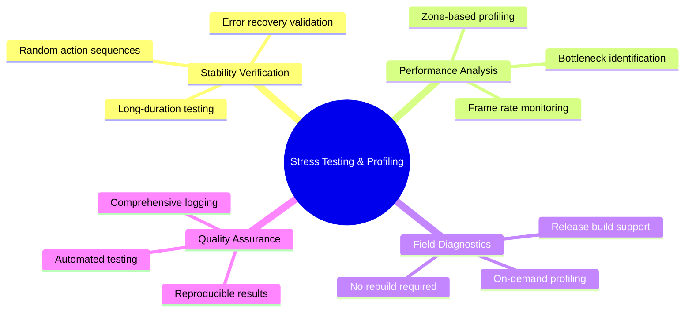

### Shared Components

All shared components are located in `Proxies/Libraries/`:

| File | Purpose |
|------|---------|
| `Libraries/Driver/IDriver.h` | Abstract driver interface for device-agnostic stress testing |
| `Libraries/StressTest/StressTest.h` | Shared stress test class declaration |
| `Libraries/StressTest/StressTest.cpp` | Shared stress test implementation |
| `Libraries/Utility/ProfilingControl.h` | Runtime profiling control with CTRACK_* macros |
| `Libraries/XML/ProxyKeywords.h` | Includes PROFILING constant |

### Implemented Proxies

The following proxies have IDriver and stress testing implemented:

| Proxy | Driver Class | Notes |
|-------|--------------|-------|
| **Vicon** | `DriverVicon` | Reference implementation |
| **Template** | `Driver` | Simulated device for testing |
| **Leica.LMF** | `LeicaDriver` | Native wrapper around managed C++/CLI driver |

---

## Proxy Architecture

### CTrack Proxy-Based Architecture

CTrack uses a **proxy-based architecture** for communicating with external measurement devices. Instead of embedding device-specific code directly into the main application, each device driver runs as a separate executable that communicates with CTrack via TCP/IP.

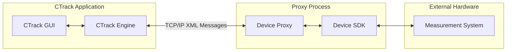

### Advantages of the Proxy Approach

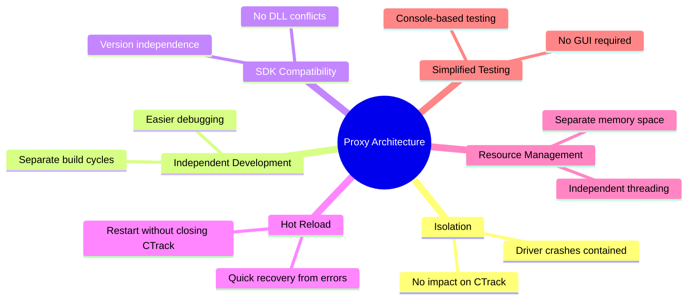

### Component Interaction

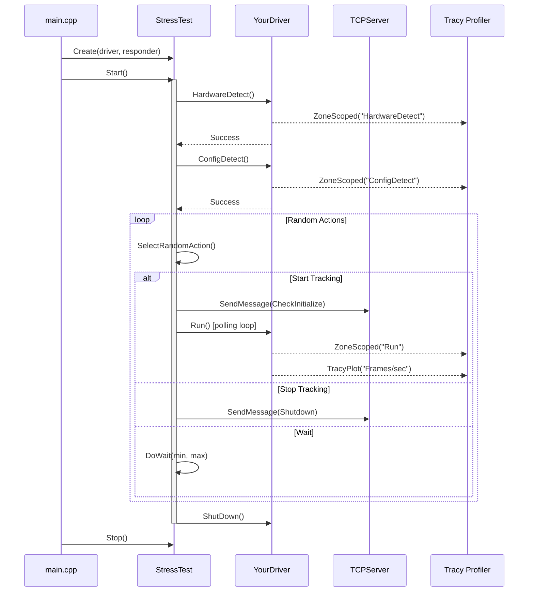

---

## Prerequisites

### Tracy Submodule

The project includes Tracy as a git submodule at the repository root:

```
C:\CTrack-software\Software\V5.0git\tracy\
```

Ensure the submodule is initialized:

```bash
git submodule update --init --recursive
```

### Required Headers

```cpp
// Tracy profiling (conditional via ProfilingControl.h)
#include "../Libraries/Utility/ProfilingControl.h"

// Standard library for stress testing
#include <thread>
#include <atomic>
#include <random>
#include <chrono>
#include <fstream>
#include <mutex>
```

### Dependencies

- **fmt library**: For formatted string output (`Proxies/Libraries/fmt/`)
- **Utility library**: For console printing (`Proxies/Libraries/Utility/Print.h`)
- **ProfilingControl.h**: For runtime profiling control (`Proxies/Libraries/Utility/ProfilingControl.h`)

---

## IDriver Interface

The stress testing system uses an abstract `IDriver` interface that enables device-agnostic stress testing across all device proxies. All drivers implement this interface.

### Architecture

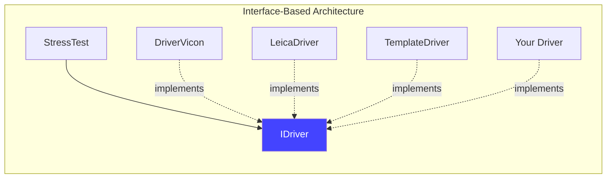

### IDriver Interface Definition

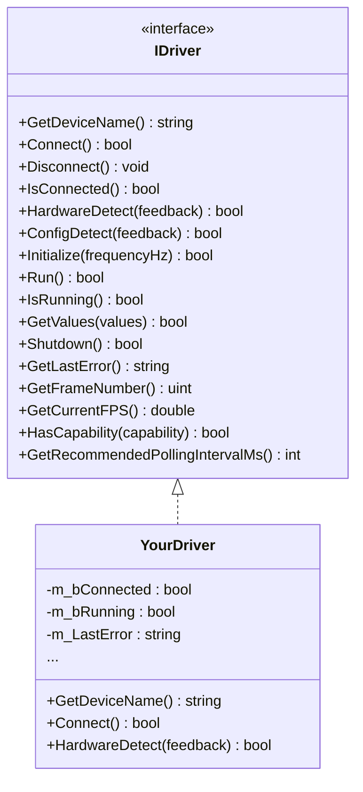

### C++ Interface Definition

The interface is located at `Proxies/Libraries/Driver/IDriver.h`:

```cpp
#pragma once

#include <string>
#include <vector>
#include <cstdint>

namespace CTrack
{

/// @brief Abstract interface for all device drivers
/// @details Enables device-agnostic stress testing and profiling
class IDriver
{
public:
    virtual ~IDriver() = default;

    //-------------------------------------------------------------------------
    // Device Information
    //-------------------------------------------------------------------------

    /// @brief Get the device name for logging purposes
    /// @return Device name (e.g., "Vicon", "Leica.LMF", "NDI.Optotrak")
    virtual std::string GetDeviceName() const = 0;

    //-------------------------------------------------------------------------
    // Connection Management
    //-------------------------------------------------------------------------

    /// @brief Establish connection to the device
    /// @return true if connection successful
    virtual bool Connect() = 0;

    /// @brief Disconnect from the device
    virtual void Disconnect() = 0;

    /// @brief Check if currently connected
    /// @return true if connected
    virtual bool IsConnected() const = 0;

    //-------------------------------------------------------------------------
    // Detection
    //-------------------------------------------------------------------------

    /// @brief Detect available hardware
    /// @param[out] feedback Description of detected hardware or error
    /// @return true if hardware detected successfully
    virtual bool HardwareDetect(std::string& feedback) = 0;

    /// @brief Detect configuration (markers, subjects, etc.)
    /// @param[out] feedback Description of detected configuration or error
    /// @return true if configuration detected successfully
    virtual bool ConfigDetect(std::string& feedback) = 0;

    //-------------------------------------------------------------------------
    // Tracking Operations
    //-------------------------------------------------------------------------

    /// @brief Initialize tracking at specified frequency
    /// @param frequencyHz Desired tracking frequency in Hz
    /// @return true if initialization successful
    virtual bool Initialize(double frequencyHz) = 0;

    /// @brief Process one frame of data
    /// @return true if frame processed successfully
    virtual bool Run() = 0;

    /// @brief Check if currently tracking
    /// @return true if tracking is active
    virtual bool IsRunning() const = 0;

    /// @brief Get the latest measurement values
    /// @param[out] values Vector to receive measurement data
    /// @return true if values available
    virtual bool GetValues(std::vector<double>& values) = 0;

    /// @brief Stop tracking and shutdown
    /// @return true if shutdown successful
    virtual bool Shutdown() = 0;

    //-------------------------------------------------------------------------
    // Status and Diagnostics
    //-------------------------------------------------------------------------

    /// @brief Get the last error message
    /// @return Error description or empty string
    virtual std::string GetLastError() const = 0;

    /// @brief Get current frame number
    /// @return Frame number (0 if not tracking)
    virtual uint32_t GetFrameNumber() const = 0;

    /// @brief Get current frames per second
    /// @return FPS value (0.0 if not tracking)
    virtual double GetCurrentFPS() const = 0;

    //-------------------------------------------------------------------------
    // Optional: Device-Specific Capabilities
    //-------------------------------------------------------------------------

    /// @brief Check if device supports a specific capability
    /// @param capability Capability name (e.g., "6DOF", "Markers", "LaserPointer")
    /// @return true if capability supported
    virtual bool HasCapability(const std::string& capability) const
    {
        return false; // Default: no special capabilities
    }

    /// @brief Get recommended polling interval in milliseconds
    /// @return Polling interval (default: 20ms for 50Hz)
    virtual int GetRecommendedPollingIntervalMs() const
    {
        return 20; // Default 50Hz
    }
};

} // namespace CTrack
```

### Implementing IDriver in Your Driver

Example implementation:

```cpp
// YourProxy/Driver.h
#include "../Libraries/Driver/IDriver.h"
#include "../Libraries/Utility/ProfilingControl.h"

class Driver : public CTrack::IDriver, public CTrack::Subscriber
{
public:
    // IDriver implementation
    std::string GetDeviceName() const override { return "YourDevice"; }

    bool Connect() override
    {
        CTRACK_ZONE_SCOPED_NC("YourDevice::Connect", 0x4488FF);  // Blue
        // ... implementation ...
        return m_bConnected;
    }

    void Disconnect() override
    {
        CTRACK_ZONE_SCOPED_NC("YourDevice::Disconnect", 0xFF4444);  // Red
        // ... implementation ...
    }

    bool IsConnected() const override { return m_bConnected; }

    bool HardwareDetect(std::string& feedback) override
    {
        CTRACK_ZONE_SCOPED_NC("YourDevice::HardwareDetect", 0x44FF44);  // Green
        // ... implementation ...
        feedback = "Hardware detected: ...";
        return true;
    }

    bool ConfigDetect(std::string& feedback) override
    {
        CTRACK_ZONE_SCOPED_NC("YourDevice::ConfigDetect", 0xFFAA00);  // Orange
        // ... implementation ...
        feedback = "Configuration: ...";
        return true;
    }

    bool Initialize(double frequencyHz) override
    {
        CTRACK_ZONE_SCOPED_NC("YourDevice::Initialize", 0x00FFFF);  // Cyan
        m_FrequencyHz = frequencyHz;
        m_bRunning = true;
        return true;
    }

    bool Run() override
    {
        CTRACK_ZONE_SCOPED_NC("YourDevice::Run", 0xFF00FF);  // Magenta
        // ... process one frame ...
        return m_bRunning;
    }

    bool IsRunning() const override { return m_bRunning; }

    bool GetValues(std::vector<double>& values) override
    {
        CTRACK_ZONE_SCOPED_NC("YourDevice::GetValues", 0x8888FF);  // Light Blue
        // ... populate values ...
        return true;
    }

    bool Shutdown() override
    {
        CTRACK_ZONE_SCOPED_NC("YourDevice::Shutdown", 0xFF8800);  // Dark Orange
        m_bRunning = false;
        return true;
    }

    std::string GetLastError() const override { return m_LastError; }
    uint32_t GetFrameNumber() const override { return m_FrameNumber; }
    double GetCurrentFPS() const override { return m_CurrentFPS; }

    int GetRecommendedPollingIntervalMs() const override
    {
        // Adjust based on your device's native rate
        return static_cast<int>(1000.0 / m_FrequencyHz);
    }

    bool HasCapability(const std::string& cap) const override
    {
        // Define your device's capabilities
        return (cap == "YourCapability1" || cap == "YourCapability2");
    }

private:
    bool m_bConnected = false;
    bool m_bRunning = false;
    std::string m_LastError;
    uint32_t m_FrameNumber = 0;
    double m_CurrentFPS = 0.0;
    double m_FrequencyHz = 50.0;
};
```

---

## Tracy Profiling Setup

Tracy profiling is now enabled in both **Debug** and **Release** build configurations using `TRACY_ON_DEMAND` mode, which means:

- **Minimal overhead** when no profiler is connected (safe for production/field use)
- **No rebuild required** - just connect the Tracy profiler GUI when you want to capture data
- **Settings-based activation** - use the `profiling` setting for runtime control
- **Field diagnostics** - profile Release builds to analyze issues in deployed systems

### How TRACY_ON_DEMAND Works

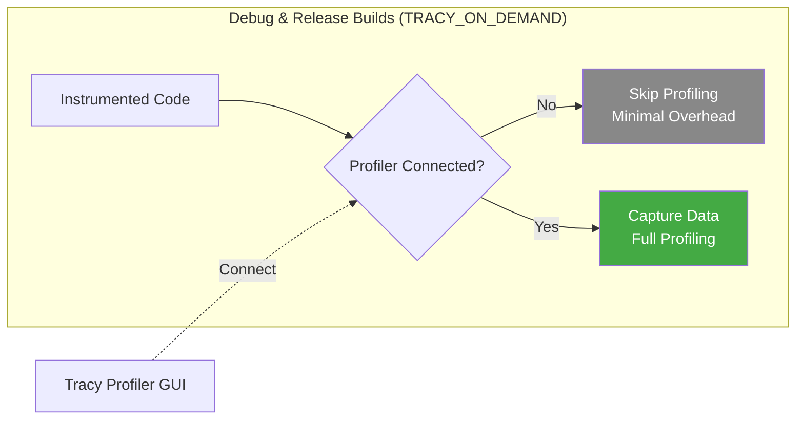

### Build Configuration Summary

| Configuration | Tracy Enabled | Use Case |
|---------------|---------------|----------|
| **Debug\|x64** | Yes (`TRACY_ON_DEMAND`) | Development and testing |
| **Release\|x64** | Yes (`TRACY_ON_DEMAND`) | Production and field diagnostics |

### Step 1: Configure Debug and Release Builds for Tracy

Add Tracy to both Debug|x64 and Release|x64 configurations in your `.vcxproj` file:

```xml
<!-- Add Tracy include path to Debug|x64 and Release|x64 PropertyGroups -->
<PropertyGroup Condition="'$(Configuration)|$(Platform)'=='Debug|x64'">
  <OutDir>..\..\bin64\$(Configuration)\Proxy\$(ProjectName)\</OutDir>
  <IncludePath>..\..\tracy\public;$(IncludePath)</IncludePath>
  <LibraryPath>..\..\Lib;$(LibraryPath)</LibraryPath>
</PropertyGroup>
<PropertyGroup Condition="'$(Configuration)|$(Platform)'=='Release|x64'">
  <OutDir>..\..\bin64\$(Configuration)\Proxy\$(ProjectName)\</OutDir>
  <IncludePath>..\..\tracy\public;$(IncludePath)</IncludePath>
  <LibraryPath>..\..\Lib;$(LibraryPath)</LibraryPath>
</PropertyGroup>

<!-- Add Tracy defines to both Debug|x64 and Release|x64 ItemDefinitionGroups -->
<ItemDefinitionGroup Condition="'$(Configuration)|$(Platform)'=='Debug|x64'">
  <ClCompile>
    <PreprocessorDefinitions>NDEBUG;_CONSOLE;TRACY_ENABLE;TRACY_ON_DEMAND;%(PreprocessorDefinitions);WIN32</PreprocessorDefinitions>
    <!-- ... other settings ... -->
  </ClCompile>
</ItemDefinitionGroup>
<ItemDefinitionGroup Condition="'$(Configuration)|$(Platform)'=='Release|x64'">
  <ClCompile>
    <PreprocessorDefinitions>NDEBUG;_CONSOLE;TRACY_ENABLE;TRACY_ON_DEMAND;%(PreprocessorDefinitions);WIN32</PreprocessorDefinitions>
    <!-- ... other settings ... -->
  </ClCompile>
</ItemDefinitionGroup>
```

### Step 2: Enable TracyClient.cpp for Debug and Release Builds

Include `TracyClient.cpp` in both x64 builds:

```xml
<ClCompile Include="..\..\tracy\public\TracyClient.cpp">
  <ExcludedFromBuild Condition="'$(Configuration)|$(Platform)'=='Debug|Win32'">true</ExcludedFromBuild>
  <ExcludedFromBuild Condition="'$(Configuration)|$(Platform)'=='Release|Win32'">true</ExcludedFromBuild>
  <!-- Debug|x64 and Release|x64 are NOT excluded - Tracy is enabled -->
</ClCompile>
```

### Step 3: Runtime Profiling Control

The `ProfilingControl.h` header (`Proxies/Libraries/Utility/ProfilingControl.h`) provides runtime control:

```cpp
#include "../Libraries/Utility/ProfilingControl.h"

int main(int argc, char* argv[])
{
    // Read profiling setting from JSON config
    bool profiling = parameters.getBool(PROFILING, false);

    // Set global profiling flag
    CTrack::SetProfilingEnabled(profiling);

    if (profiling)
    {
        PrintInfo("Tracy profiling enabled - connect Tracy profiler to capture data");
    }

    // Main loop with frame marking
    while (bContinueLoop)
    {
        CTRACK_FRAME_MARK();
        // ... loop body ...
    }
}
```

### Step 4: Add Tracy Zones to Driver Functions

Use the `CTRACK_*` macros which respect the profiling flag:

```cpp
#include "../Libraries/Utility/ProfilingControl.h"

bool YourDriver::HardwareDetect(std::string& feedback)
{
    CTRACK_ZONE_SCOPED_NC("YourDevice::HardwareDetect", 0x44FF44);  // Green
    // ... implementation ...
}
```

### Profiling Settings File

Add the `profiling` setting to your proxy's JSON configuration:

```json
{
    "tcpport": 40001,
    "showconsole": true,
    "profiling": true
}
```

**How `profiling` controls Tracy:**
- When `profiling` is `false` (default): Tracy zones are disabled at runtime
- When `profiling` is `true`: Tracy zones are active when the Tracy profiler GUI connects

### Tracy Color Scheme

Use consistent colors across all proxies for similar operations:

| Function Type | Color | Hex Code | Description |
|--------------|-------|----------|-------------|
| Connect | Blue | `0x4488FF` | Connection establishment |
| Disconnect | Red | `0xFF4444` | Connection termination |
| HardwareDetect | Green | `0x44FF44` | Hardware detection |
| ConfigDetect | Orange | `0xFFAA00` | Configuration detection |
| Initialize/CheckInitialize | Cyan | `0x00FFFF` | Initialization |
| Run | Magenta | `0xFF00FF` | Frame processing |
| GetValues | Light Blue | `0x8888FF` | Value retrieval |
| ShutDown | Dark Orange | `0xFF8800` | Shutdown |
| Wait | Gray | `0x888888` | Waiting periods |

### Tracy Messages

Log messages with colors in Tracy:

```cpp
// Info messages - Green
CTRACK_MESSAGE_C(message.c_str(), message.size(), 0x44FF44);

// Warning messages - Yellow
CTRACK_MESSAGE_C(message.c_str(), message.size(), 0xFFFF00);

// Error messages - Red
CTRACK_MESSAGE_C(message.c_str(), message.size(), 0xFF4444);
```

### Tracy Plots

Track metrics over time:

```cpp
CTRACK_PLOT("Frames/sec", static_cast<int64_t>(framesProcessed));
```

---

## Stress Test Implementation

### Stress Test Architecture

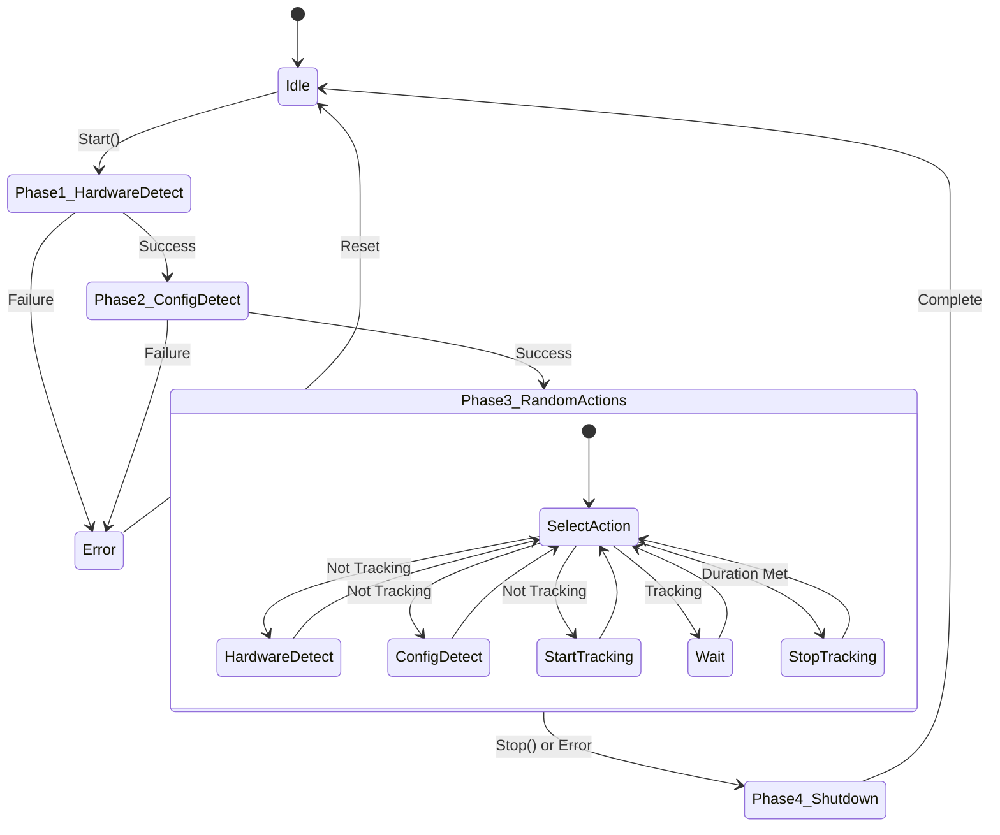

### Test Phases

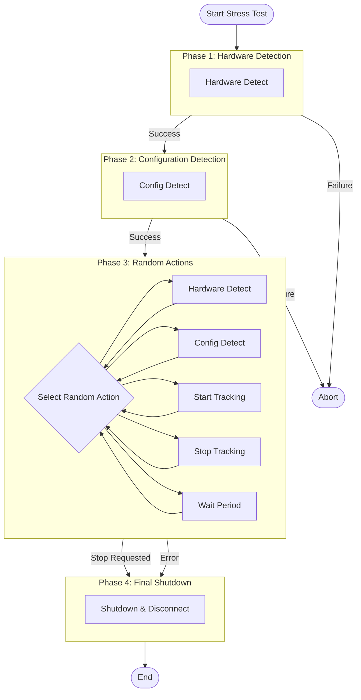

### Using Shared StressTest Class

The shared `StressTest` class is located in `Proxies/Libraries/StressTest/`:

**Add to your `.vcxproj` file:**
```xml
<ClCompile Include="..\Libraries\StressTest\StressTest.cpp" />
<ClInclude Include="..\Libraries\StressTest\StressTest.h" />
```

**Usage in your `main.cpp`:**
```cpp
#include "../Libraries/StressTest/StressTest.h"

int main()
{
    // Create driver implementing IDriver interface
    std::unique_ptr<YourDriver> driver = std::make_unique<YourDriver>();

    // Setup TCP server...
    CTCPServer TCPServer;
    // ... TCP initialization ...

    // Create stress test (device-agnostic)
    std::unique_ptr<StressTest> stressTest =
        std::make_unique<StressTest>(driver.get(), TCPServer.GetMessageResponder());

    // Main loop...
}
```

### Action Types

| Action | Description | When Available |
|--------|-------------|----------------|
| Hardware Detect | Re-detect device hardware | When not tracking |
| Config Detect | Re-detect configuration | When not tracking |
| Start Tracking | Begin frame acquisition | When not tracking |
| Stop Tracking | End frame acquisition | When tracking and duration met |
| Wait Short | Wait 5-30 seconds | Always |
| Wait Medium | Wait 30-120 seconds | Always |
| Wait Long | Wait 2-5 minutes | Always |

### Tracking State Machine

When tracking is active, the stress test enforces a minimum measurement duration (10-120 seconds randomly selected) before allowing stop:

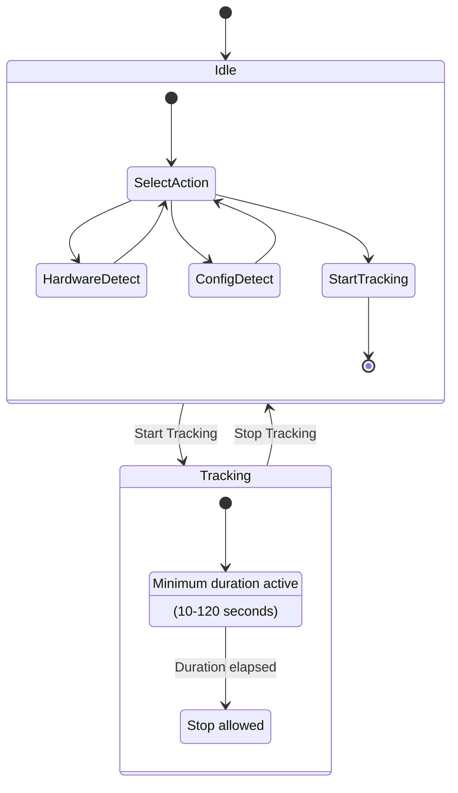

### Frame Processing During Tracking

While tracking is active, the stress test:
- Calls `Run()` at the device's recommended polling interval
- Displays frame number and FPS in the console
- Logs frame processing statistics periodically

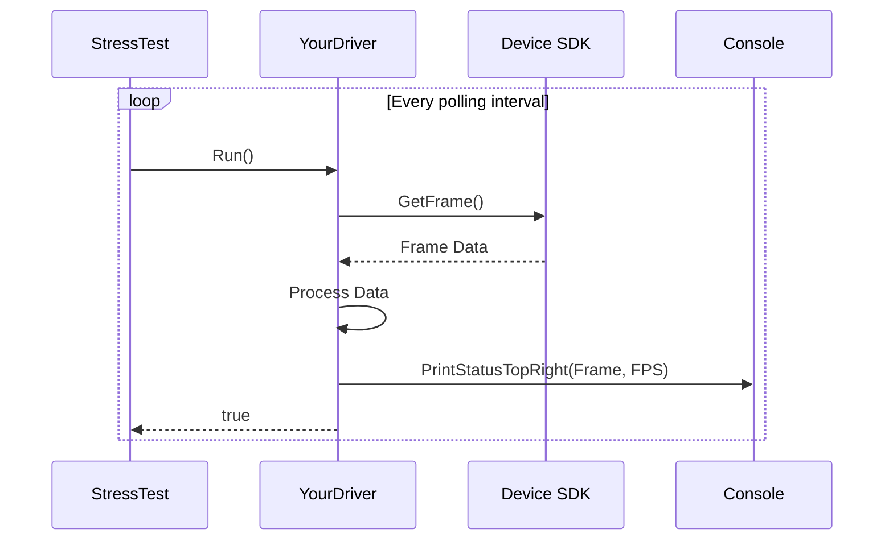

---

## Main Loop Integration

### Main Loop Architecture

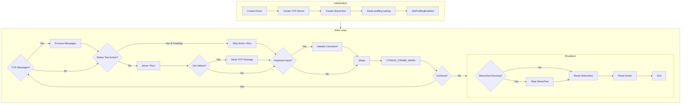

### Integration Example

```cpp
#include "../Libraries/StressTest/StressTest.h"
#include "../Libraries/Utility/ProfilingControl.h"

int main(int argc, char* argv[])
{
    // Read settings
    bool profiling = parameters.getBool(PROFILING, false);
    CTrack::SetProfilingEnabled(profiling);

    // Create driver
    std::unique_ptr<YourDriver> driver = std::make_unique<YourDriver>();

    // Setup TCP server
    CTCPServer TCPServer;
    // ... TCP initialization ...

    // Create stress test
    std::unique_ptr<StressTest> stressTest =
        std::make_unique<StressTest>(driver.get(), TCPServer.GetMessageResponder());

    // Main loop
    bool bRun = true;
    while (bRun)
    {
        CTRACK_FRAME_MARK();

        // Check for incoming TCP messages
        TCPServer.ProcessMessages();

        // Skip driver->Run() if stress test is handling tracking
        bool stressTestTracking = stressTest &&
                                  stressTest->IsRunning() &&
                                  stressTest->IsTracking();

        if (!stressTestTracking && driver->Run())
        {
            std::vector<double> values;
            if (driver->GetValues(values))
            {
                auto gram = std::make_unique<CTCPGram>(values);
                TCPServer.PushSendPackage(gram);
            }
        }

        // Handle user input
        if (_kbhit())
        {
            int key = _getch();
            switch (key)
            {
                case 'z':
                    if (stressTest && !stressTest->IsRunning())
                    {
                        stressTest->Start();
                        PrintInfo("Stress test started");
                    }
                    break;

                case 'y':
                    if (stressTest && stressTest->IsRunning())
                    {
                        stressTest->Stop();
                        PrintInfo("Stress test stopping...");
                    }
                    break;

                case 'q':
                    bRun = false;
                    break;
            }
        }

        // Sleep to prevent CPU spinning
        std::this_thread::sleep_for(std::chrono::milliseconds(10));
    }

    // Clean shutdown
    if (stressTest && stressTest->IsRunning())
    {
        PrintInfo("Stopping stress test before shutdown...");
        stressTest->Stop();
    }
    stressTest.reset();
    driver.reset();

    return 0;
}
```

---

## Logging System

### Logging Architecture

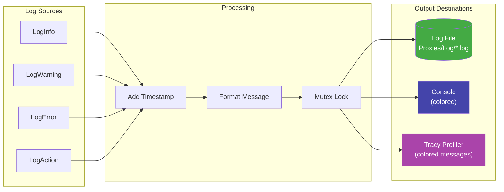

### Log Message Flow

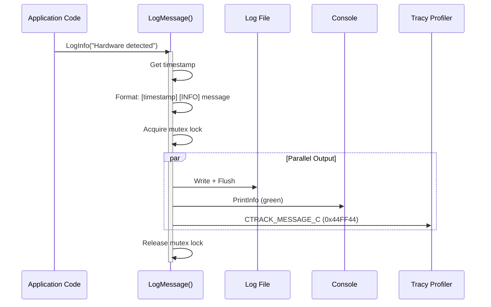

### Log File Location

Stress test logs are created in `Proxies/Log/` with timestamped names:

```
Proxies/Log/{DeviceName}_StressTest_YYYYMMDD_HHMMSS.log
```

Example:
```
Proxies/Log/Vicon_StressTest_20241215_143022.log
Proxies/Log/LeicaLMF_StressTest_20241215_150145.log
```

### Log Format

Each log entry includes:
```
[YYYY-MM-DD HH:MM:SS.mmm] [LEVEL] Message
```

Levels: `INFO`, `WARNING`, `ERROR`, `ACTION`

### Log Contents

The log file records:

1. **Test Configuration** - Start time, device name, test parameters
2. **Phase Results** - Hardware detection, configuration detection
3. **Action Log** - Each action with success/failure status and duration
4. **Frame Statistics** - Tracking state and frame processing counts
5. **Test Summary** - Total duration, iterations, success and error counts

### Example Log Output

```
[2025-12-15 15:39:36.067] [INFO] ========================================
[2025-12-15 15:39:36.067] [INFO] STRESS TEST STARTED
[2025-12-15 15:39:36.067] [INFO] ========================================
[2025-12-15 15:39:36.067] [INFO] Device: YourDevice
[2025-12-15 15:39:36.068] [INFO] Measurement duration: 10-120 seconds (randomly selected per tracking session)
[2025-12-15 15:39:36.070] [INFO] ========================================
[2025-12-15 15:39:36.070] [INFO] Phase 1: Hardware Detection
[2025-12-15 15:39:36.072] [INFO] ========================================
[2025-12-15 15:39:36.190] [ACTION] HardwareDetect: SUCCESS - [hardware details]
[2025-12-15 15:39:36.191] [INFO] Phase 1 PASSED: [feedback]
[2025-12-15 15:39:36.191] [INFO] ========================================
[2025-12-15 15:39:36.191] [INFO] Phase 2: Configuration Detection
[2025-12-15 15:39:36.191] [INFO] ========================================
[2025-12-15 15:39:36.234] [ACTION] ConfigDetect: SUCCESS - [configuration details]
[2025-12-15 15:39:36.235] [INFO] Phase 2 PASSED: [feedback]
[2025-12-15 15:39:36.235] [INFO] ========================================
[2025-12-15 15:39:36.235] [INFO] Phase 3: Random Actions Loop
[2025-12-15 15:39:36.235] [INFO] ========================================
[2025-12-15 15:39:37.933] [ACTION] StartTracking: SUCCESS - will track for 42 seconds
[2025-12-15 15:39:48.540] [INFO] Wait progress: 10/20 sec, 50 frames processed
...
[2025-12-15 15:41:03.826] [INFO] ========================================
[2025-12-15 15:41:03.827] [INFO] STRESS TEST COMPLETED
[2025-12-15 15:41:03.827] [INFO] ========================================
[2025-12-15 15:41:03.827] [INFO] Total duration: 0h 1m 27s
[2025-12-15 15:41:03.828] [INFO] Total iterations: 7
[2025-12-15 15:41:03.828] [INFO] Successful actions: 7
[2025-12-15 15:41:03.829] [INFO] Errors encountered: 0
```

---

## Console Commands

Add these keyboard shortcuts to your main loop for manual control and testing:

| Key | Action | Description |
|-----|--------|-------------|
| `z` | Start Stress Test | Begin automated testing |
| `y` | Stop Stress Test | Gracefully stop testing |
| `h` | Hardware Detect | Manual hardware detection |
| `c` | Config Detect | Manual configuration detection |
| `s` | Start Tracking | Manual tracking start |
| `t` | Stop Tracking | Manual tracking stop |
| `q` | Quit | Exit the proxy |

### Implementation

```cpp
if (_kbhit())
{
    int key = _getch();
    switch (key)
    {
        case 'z':
            if (stressTest && !stressTest->IsRunning())
            {
                stressTest->Start();
                PrintInfo("Stress test started - press 'y' to stop");
            }
            else if (stressTest && stressTest->IsRunning())
            {
                PrintWarning("Stress test already running - press 'y' to stop");
            }
            break;

        case 'y':
            if (stressTest && stressTest->IsRunning())
            {
                stressTest->Stop();
                PrintInfo("Stress test stopping...");
            }
            else
            {
                PrintWarning("Stress test is not running");
            }
            break;

        case 'h':
            {
                std::string feedback;
                if (driver->HardwareDetect(feedback))
                {
                    PrintInfo("Hardware detect: " + feedback);
                }
                else
                {
                    PrintError("Hardware detect failed: " + feedback);
                }
            }
            break;

        case 'q':
            bRun = false;
            break;

        // ... other commands ...
    }
}
```

---

## Testing and Validation

### Pre-Deployment Checklist

Before deploying stress testing to a new proxy:

- [ ] **IDriver Interface**: Driver class inherits from `CTrack::IDriver`
- [ ] **All Methods Implemented**: All virtual methods have implementations
- [ ] **Tracy Configuration**: Debug and Release builds include Tracy
- [ ] **ProfilingControl.h**: Included and `CTRACK_*` macros used
- [ ] **StressTest Integration**: Shared StressTest class added to project
- [ ] **Settings File**: JSON config includes `profiling` setting
- [ ] **Main Loop**: Yields to stress test when tracking
- [ ] **Console Commands**: 'z' and 'y' keys for stress test control
- [ ] **Log Directory**: `Proxies/Log/` directory exists or is created
- [ ] **Clean Shutdown**: Stress test stopped before exit

### Quick Start Testing

1. Build the proxy in **Debug|x64** or **Release|x64** configuration
2. Create a settings file with profiling enabled:
   ```json
   {"tcpport": 40001, "showconsole": true, "profiling": true}
   ```
3. Run the proxy - you should see "Tracy profiling enabled" message
4. Start Tracy Profiler and connect to the running process
5. Press 'z' to start stress test
6. Observe profiling data in Tracy
7. Check log file created in `Proxies/Log/`

### Field Diagnostics

For analyzing issues in deployed systems:

1. Deploy the **Release|x64** build (Tracy is included with minimal overhead)
2. When an issue occurs, connect Tracy Profiler remotely or locally
3. Capture profiling data without needing to rebuild or redeploy
4. `TRACY_ON_DEMAND` ensures zero overhead when not profiling

### Stress Test Validation

Run the stress test for extended periods (hours or overnight) to verify:

- [ ] **No Memory Leaks**: Use Visual Studio Diagnostic Tools
- [ ] **No Thread Deadlocks**: Monitor for hangs
- [ ] **Error Recovery**: Test behavior after connection loss
- [ ] **Log Completeness**: All events captured in log file
- [ ] **Frame Rate Stability**: FPS remains consistent during tracking
- [ ] **Multiple Cycles**: Start/stop tracking works repeatedly
- [ ] **Console Output**: Status updates display correctly

### Tracy Validation

With Tracy Profiler connected, verify:

- [ ] **All Zones Present**: Driver functions appear as zones
- [ ] **Correct Colors**: Zones use assigned color scheme
- [ ] **Zone Timing**: Duration matches expected function behavior
- [ ] **Message Colors**: Info (green), warning (yellow), error (red)
- [ ] **Frame Marks**: Frame boundaries visible in timeline
- [ ] **Plots**: FPS plot shows frame rate data
- [ ] **No Gaps**: Continuous profiling during tracking

### Error Handling Validation

Test error scenarios:

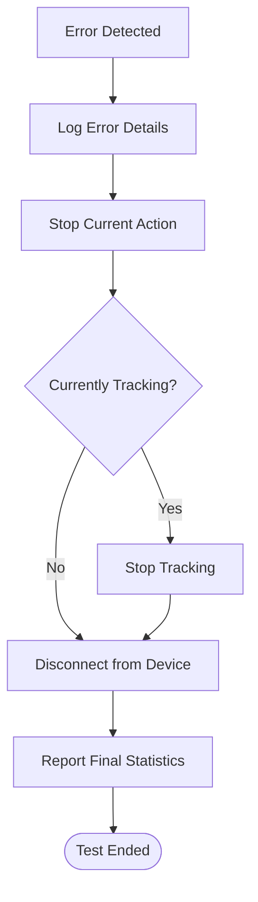

Common error scenarios to test:

| Error Scenario | Expected Behavior |
|----------------|-------------------|
| Device Disconnected | Log error, stop tracking, report statistics |
| Hardware Not Found | Phase 1 fails, test aborts |
| Configuration Error | Phase 2 fails, test aborts |
| Tracking Start Fails | Log error, continue with other actions |
| Frame Loss | Log warning, continue tracking |

---

## Device-Specific Considerations

### Frame Rate Adaptation

Different devices have different native frame rates. The `IDriver::GetRecommendedPollingIntervalMs()` method allows the stress test to adapt:

| Device Type | Typical Rate | Recommended Poll Interval |
|------------|--------------|---------------------------|
| Optical (Vicon, etc.) | 50-250 Hz | 20ms (50 Hz) |
| Laser Tracker (Leica) | 10-1000 Hz | Varies by mode |
| Optotrak (NDI) | 100-4600 Hz | 10ms (100 Hz) |
| iGPS | 40 Hz | 25ms (40 Hz) |

**Example implementation:**

```cpp
int GetRecommendedPollingIntervalMs() const override
{
    // For variable-rate devices, calculate based on current mode
    if (m_HighSpeedMode)
        return 1;   // 1000 Hz
    else
        return 100; // 10 Hz

    // For fixed-rate devices, use a constant
    // return 20;   // 50 Hz
}
```

The stress test uses this value in its wait loops:

```cpp
void StressTest::DoWait(int minSeconds, int maxSeconds)
{
    // Use device-specific polling interval
    int pollingIntervalMs = m_pDriver->GetRecommendedPollingIntervalMs();
    int framesPerSecond = 1000 / pollingIntervalMs;

    while (/* ... */)
    {
        if (m_bCurrentlyTracking && m_pDriver->IsRunning())
        {
            for (int i = 0; i < framesPerSecond && !m_bStopRequested; i++)
            {
                m_pDriver->Run();
                std::this_thread::sleep_for(std::chrono::milliseconds(pollingIntervalMs));
            }
        }
    }
}
```

### Device Capabilities

Use `HasCapability()` to advertise device-specific features:

```cpp
bool HasCapability(const std::string& cap) const override
{
    // Optical tracking system
    return (cap == "6DOF" || cap == "Markers" || cap == "UnlabeledMarkers");

    // Laser tracker
    // return (cap == "LaserTracker" || cap == "ADM" || cap == "IFM");

    // Coordinate measurement machine
    // return (cap == "CMM" || cap == "TouchProbe" || cap == "LaserScanner");
}
```

### Managed C++/CLI Considerations (e.g., Leica.LMF)

For proxies using managed C++/CLI:

1. **Create Native Wrapper**: Implement IDriver with a native class that wraps managed calls
2. **Exception Handling**: Convert managed exceptions to native error messages
3. **String Conversion**: Use `msclr::interop::marshal_as<std::string>()` for string conversion
4. **GC Considerations**: Use `gcroot<>` for managed member variables

**Example:**

```cpp
// Native wrapper class
class LeicaDriver : public CTrack::IDriver
{
public:
    std::string GetDeviceName() const override { return "Leica.LMF"; }

    bool HardwareDetect(std::string& feedback) override
    {
        try
        {
            // Call managed Leica SDK
            auto result = m_pManagedDriver->DetectHardware();
            feedback = msclr::interop::marshal_as<std::string>(result->Description);
            return result->Success;
        }
        catch (System::Exception^ ex)
        {
            feedback = msclr::interop::marshal_as<std::string>(ex->Message);
            return false;
        }
    }

private:
    gcroot<ManagedLeicaDriver^> m_pManagedDriver;
};
```

---

## Reference Implementations

### Vicon Proxy (Reference Implementation)

The Vicon proxy (`Proxies/Vicon/`) contains the complete reference implementation:

```
Proxies/Vicon/
├── DriverVicon.h              # Implements IDriver with Tracy zones
├── DriverVicon.cpp            # Full Tracy instrumentation
├── main.cpp                   # StressTest integration, console commands
└── Vicon.vcxproj              # Tracy configuration for Debug/Release
```

**Key features:**
- Complete IDriver implementation
- Tracy zones in all driver methods
- Stress test integration in main loop
- Console command handling
- FPS monitoring and display
- Comprehensive logging

### Template Proxy

The Template proxy (`Proxies/Template/`) provides a minimal starting point:

```
Proxies/Template/
├── Driver.h                   # Implements IDriver (simulated device)
├── Driver.cpp                 # Basic implementations
├── main.cpp                   # StressTest integration
└── Template.vcxproj           # Tracy configuration
```

**Use this as a starting point** for new proxy implementations.

### Leica.LMF Proxy

The Leica.LMF proxy (`Proxies/Leica.LMF/`) demonstrates managed C++/CLI integration:

```
Proxies/Leica.LMF/
├── LeicaDriver.h              # Native wrapper implementing IDriver
├── LeicaDriver.cpp            # Wraps managed CLeicaLMFDriver
├── main.cpp                   # Uses shared StressTest
└── Leica.LMF.vcxproj          # Mixed native/managed build
```

---

## File Checklist for New Proxy

### Implementation Steps

```mermaid
flowchart LR
    subgraph Step1["Step 1: Implement IDriver"]
        A1[Include IDriver.h] --> A2[Inherit from CTrack::IDriver]
        A2 --> A3[Implement all interface methods]
    end

    subgraph Step2["Step 2: Add Shared Components"]
        B1[Add StressTest to project] --> B2[Add ProfilingControl.h includes]
    end

    subgraph Step3["Step 3: Configure Tracy"]
        C1[Add Tracy include path] --> C2[Add TRACY_ENABLE, TRACY_ON_DEMAND]
        C2 --> C3[Include TracyClient.cpp]
    end

    subgraph Step4["Step 4: Integrate"]
        D1[Update main.cpp] --> D2[Add console commands z/y]
        D2 --> D3[Add CTRACK_* zones to driver]
        D3 --> D4[Read profiling setting]
    end

    subgraph Step5["Step 5: Test"]
        E1[Build Debug|x64] --> E2[Connect Tracy profiler]
        E2 --> E3[Run stress test]
        E3 --> E4[Verify logs]
    end

    Step1 --> Step2 --> Step3 --> Step4 --> Step5
```

### Required Files

**Shared Components (just include/reference):**
```
Proxies/Libraries/
├── Driver/IDriver.h                      # Include in your driver header
├── Utility/ProfilingControl.h            # Include in driver and main
└── StressTest/
    ├── StressTest.h                      # Add to your .vcxproj
    └── StressTest.cpp                    # Add to your .vcxproj
```

**Your Proxy Files (modify/create):**
```
Proxies/YourDevice/
├── Driver.h                              # Inherit from CTrack::IDriver
├── Driver.cpp                            # Implement IDriver methods, add CTRACK_* zones
├── main.cpp                              # Add stress test, profiling setting, CTRACK_FRAME_MARK
├── YourDevice.vcxproj                    # Add Tracy to Debug|x64 and Release|x64 configs
└── settings.json                         # Add "profiling": true
```

**Automatically Created:**
```
Proxies/Log/
└── YourDevice_StressTest_*.log           # Created during stress test
```

### Minimal main.cpp Template

```cpp
#include "Driver.h"
#include "../Libraries/StressTest/StressTest.h"
#include "../Libraries/Utility/ProfilingControl.h"
#include "../Libraries/Utility/Print.h"
#include <conio.h>

int main(int argc, char* argv[])
{
    // Read settings
    CParameters parameters;
    parameters.ReadFile("settings.json");
    bool profiling = parameters.getBool(PROFILING, false);
    CTrack::SetProfilingEnabled(profiling);

    if (profiling)
        PrintInfo("Tracy profiling enabled");

    // Create driver
    auto driver = std::make_unique<Driver>();

    // Setup TCP server
    CTCPServer TCPServer;
    // ... TCP initialization ...

    // Create stress test
    auto stressTest = std::make_unique<StressTest>(driver.get(), TCPServer.GetMessageResponder());

    // Main loop
    bool bRun = true;
    while (bRun)
    {
        CTRACK_FRAME_MARK();

        TCPServer.ProcessMessages();

        bool stressTestTracking = stressTest && stressTest->IsRunning() && stressTest->IsTracking();

        if (!stressTestTracking && driver->Run())
        {
            std::vector<double> values;
            if (driver->GetValues(values))
            {
                auto gram = std::make_unique<CTCPGram>(values);
                TCPServer.PushSendPackage(gram);
            }
        }

        if (_kbhit())
        {
            int key = _getch();
            switch (key)
            {
                case 'z': if (stressTest && !stressTest->IsRunning()) stressTest->Start(); break;
                case 'y': if (stressTest && stressTest->IsRunning()) stressTest->Stop(); break;
                case 'q': bRun = false; break;
            }
        }

        std::this_thread::sleep_for(std::chrono::milliseconds(10));
    }

    // Clean shutdown
    if (stressTest && stressTest->IsRunning())
        stressTest->Stop();

    return 0;
}
```

---

## Summary

To add stress testing and profiling to a new proxy:

1. **Implement IDriver** - Inherit from `CTrack::IDriver` in your driver class
2. **Add Shared Components** - Reference `StressTest.h/cpp` and `ProfilingControl.h`
3. **Configure Tracy** - Add Tracy to Debug and Release builds in `.vcxproj`
4. **Instrument Driver** - Add `CTRACK_ZONE_SCOPED_NC()` to all driver methods
5. **Integrate Main Loop** - Create StressTest, add console commands, yield when tracking
6. **Test** - Build, run Tracy profiler, press 'z' to start stress test, verify logs

The result is a robust, production-ready proxy with:
- Device-agnostic stress testing
- On-demand profiling in all builds
- Comprehensive logging
- Manual and automated testing capabilities
- Field diagnostic support

---

## References

- **IDriver Interface**: `Proxies/Libraries/Driver/IDriver.h`
- **Profiling Control**: `Proxies/Libraries/Utility/ProfilingControl.h`
- **Shared StressTest**: `Proxies/Libraries/StressTest/`
- **Profiling Setting**: `PROFILING` constant in `Proxies/Libraries/XML/ProxyKeywords.h`
- **Reference Implementation**: `Proxies/Vicon/` - Complete working example
- **Template Proxy**: `Proxies/Template/` - Minimal starting point
- **Tracy Documentation**: https://github.com/wolfpld/tracy
- **Proxy Architecture Guide**: `Proxies/Instructions to add a proxy driver.md`
