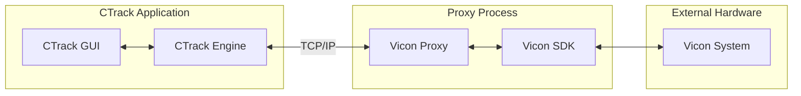
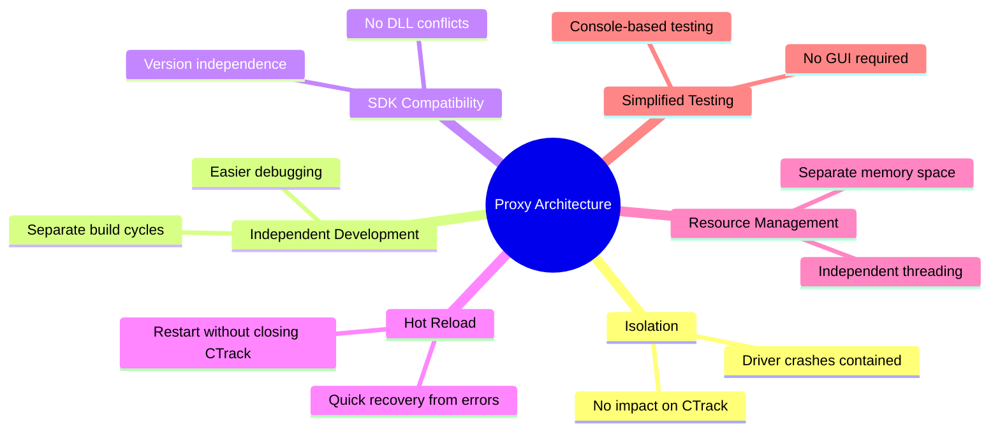
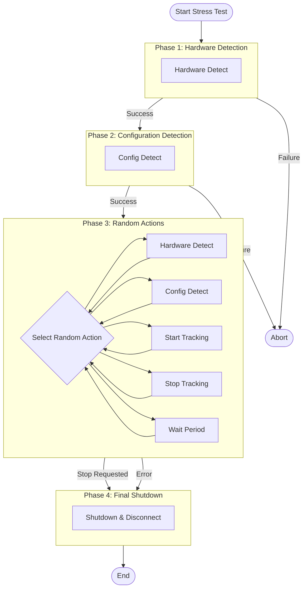
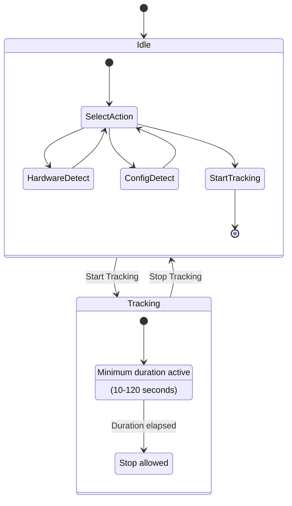
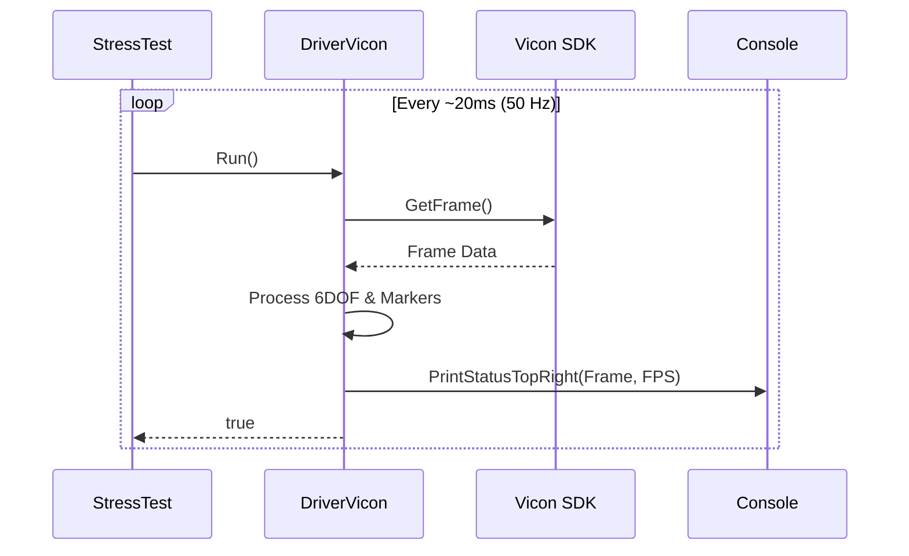
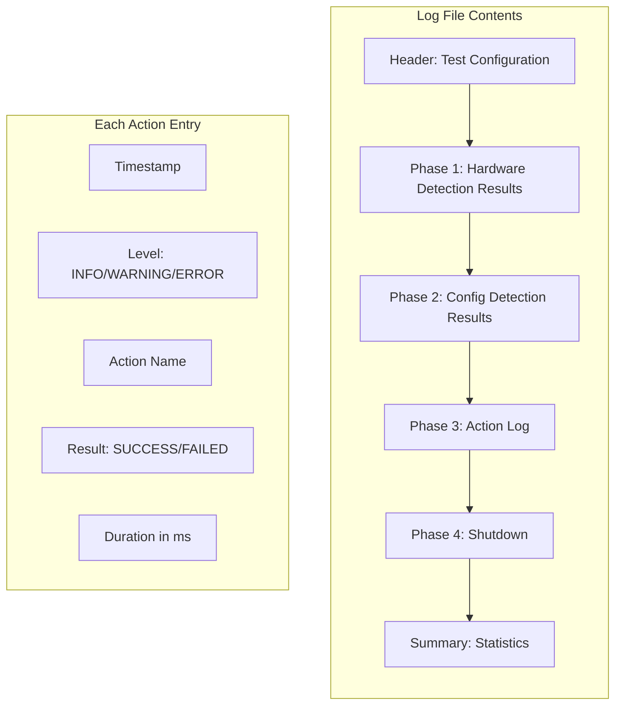
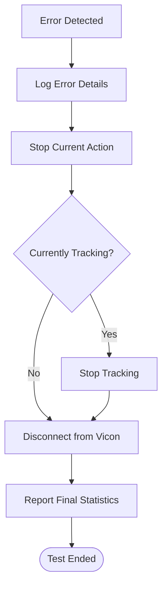

# Vicon Driver Testing Guide

## Proxy Architecture Overview

CTrack uses a **proxy-based architecture** for communicating with external measurement devices. Instead of embedding device-specific code directly into the main application, each device driver runs as a separate executable that communicates with CTrack via TCP/IP.



### Advantages of the Proxy Approach



## Stress Testing the Vicon Driver

The Vicon proxy includes a built-in stress test facility to verify communication stability over extended periods. This is essential for validating that the driver can maintain reliable connections during long measurement sessions.

### Starting the Stress Test

1. Launch the Vicon proxy executable
2. Press `z` to start the stress test
3. Press `y` to stop the stress test

### Test Phases

The stress test executes in four phases:



### Action Types

| Action | Description |
|--------|-------------|
| Hardware Detect | Re-detect Vicon hardware |
| Config Detect | Re-detect markers and subjects |
| Start Tracking | Begin frame acquisition at 50 Hz |
| Stop Tracking | End frame acquisition |
| Wait Short | Wait 5-30 seconds |
| Wait Medium | Wait 30-120 seconds |
| Wait Long | Wait 2-5 minutes |

### Tracking State Machine

When tracking is active, the stress test enforces a minimum measurement duration (10-120 seconds randomly selected) before allowing stop:



### Frame Processing During Tracking

While tracking is active, the stress test:
- Calls `Run()` at approximately 50 Hz to process incoming frames
- Displays frame number and FPS in the console's top-right corner
- Logs frame processing statistics every 10 seconds



### Tracy Profiling Integration

When built with Tracy profiling enabled (`TRACY_ENABLE`), the stress test provides detailed profiling zones:

```mermaid
gantt
    title Tracy Zone Hierarchy During Frame Processing
    dateFormat X
    axisFormat %s

    section Zones
    StressTest::Wait           :0, 100
    StressTest::FrameProcessing :5, 95
    StressTest::Frame          :10, 30
    Vicon::Run                 :12, 28
    StressTest::Frame          :35, 55
    Vicon::Run                 :37, 53
    StressTest::Frame          :60, 80
    Vicon::Run                 :62, 78
```



| Zone | Color | Description |
|------|-------|-------------|
| `StressTest::Wait` | Gray | Overall wait period |
| `StressTest::FrameProcessing` | Cyan | Each ~1 second batch of frames |
| `StressTest::Frame` | Dark Cyan | Individual frame processing |
| `StressTest::HardwareDetect` | Green | Hardware detection calls |
| `StressTest::ConfigDetect` | Orange | Configuration detection calls |
| `StressTest::StartTracking` | Cyan | Start tracking calls |
| `StressTest::StopTracking` | Red | Stop tracking calls |

A `Frames/sec` plot tracks the number of frames processed per second.

## Log File Output

All stress test activity is logged to a dedicated file for post-test analysis.

### Log File Location

```
Proxies/Log/ViconStressTest_YYYYMMDD_HHMMSS.log
```

### Log Structure



### Log Format

Each log entry includes:
```
[YYYY-MM-DD HH:MM:SS.mmm] [LEVEL] Message
```

Levels: `INFO`, `WARNING`, `ERROR`

### Log Contents

The log file records:

1. **Test Configuration** - Start time, test parameters, measurement duration range
2. **Action Results** - Each action with success/failure status and duration
3. **Hardware Information** - Detected cameras, markers, and 6DOF subjects
4. **Frame Processing Statistics** - Tracking state and Run() call counts
5. **Test Summary** - Total duration, iterations, success and error counts

### Example Log Output

```
[2025-12-12 15:39:36.067] [INFO] === STRESS TEST STARTED ===
[2025-12-12 15:39:36.067] [INFO] Purpose: Test Vicon communication stability
[2025-12-12 15:39:36.068] [INFO] Measurement duration: 10-120 seconds (randomly selected per tracking session)
[2025-12-12 15:39:36.070] [INFO] Test loop started
[2025-12-12 15:39:36.070] [INFO] === PHASE 1: Hardware Detection ===
[2025-12-12 15:39:36.072] [INFO] Executing Hardware Detect...
[2025-12-12 15:39:36.190] [INFO] Hardware present: Yes
[2025-12-12 15:39:36.191] [INFO] Feedback: SDK Version 1:12:0:145507
Detected 4 cameras
[2025-12-12 15:39:37.933] [INFO] Executing Start Tracking...
[2025-12-12 15:39:38.027] [INFO] Tracking started successfully at 50 Hz - will track for 42 seconds before allowing stop
[2025-12-12 15:39:38.540] [INFO] DoWait state: m_bCurrentlyTracking=true, driver->IsRunning()=true
[2025-12-12 15:39:48.540] [INFO] Processed 50 Run() calls in last second
...
[2025-12-12 15:41:03.826] [INFO] === STRESS TEST COMPLETED ===
[2025-12-12 15:41:03.827] [INFO] Total duration: 0h 1m 27s
[2025-12-12 15:41:03.828] [INFO] Total iterations: 7
[2025-12-12 15:41:03.828] [INFO] Successful actions: 7
[2025-12-12 15:41:03.829] [INFO] Errors encountered: 0
```

## Error Handling

The stress test automatically stops on any error to prevent cascading failures:



Common error scenarios:

| Error | Message | Cause |
|-------|---------|-------|
| Connection Lost | `Driver Run() returned false during wait` | Network or SDK issue |
| Hardware Not Found | `Hardware not detected` | Vicon system offline |
| Tracking Failed | `Failed to start tracking` | Configuration error |

## Console Commands Reference

| Key | Action |
|-----|--------|
| `q` | Quit the proxy |
| `h` | Manual hardware detect |
| `c` | Manual configuration detect |
| `s` | Manual start tracking |
| `t` | Manual stop tracking |
| `z` | Start stress test |
| `y` | Stop stress test |
